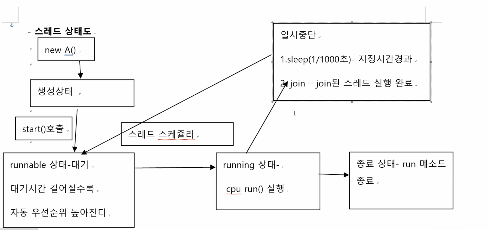
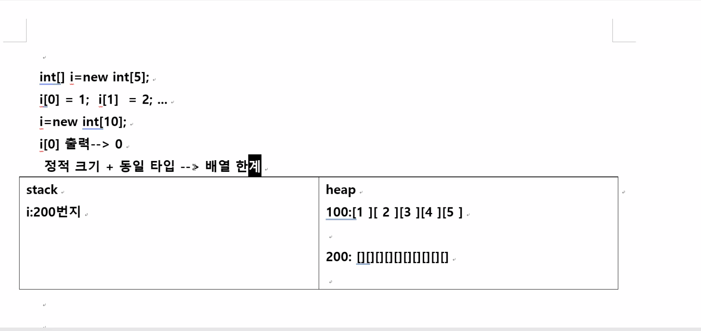

## 220706 자바

#### 1교시

- `Java.lang.Object`
  1. 자바 최상위 클래스
  2. 메소드들은 자바 다른 클래스 포함
  3. `toString() `오버라이딩
     1. Sop출력문 자동 호출 결과 출력
     2. 객체 출력내용 변경 지정
  4. `equals()`
     1. 두 객체의 동등성 비교
     2. 변경하지 않으면 두 객체 주소 같으면 t/f
     3. 오버라이딩하면 두 객체 주소가아닌 다른 값 비교

- `java.lang.System`

  - 변수와 메소드 ` static`
    - `system.in` , `system.out`, `system.currentMillis()`, `system.exit(0)`, `system.getProperties("os.name") `
      - Os.name, fileseperator 등등

- `Java.lang.Class`

  1. 클래스 내부 정보 제공
  2. 특정 클래스 타입 객체 생성 - 동적
     1. `Class c = new Class.forName("test.A");`
     2. `c.newInstance();`

- `Java.lang.String`

  1. 문자열 표현 조작 기능 메소드 제공
  2. `String s = "string" (new키워드 사용 없이도)`
  3. +연산자 사용가능
  4. 생성자
     1. `Char []` ,` byte[]` 을 `string`으로 변경
  5. 메소드
     1. 대소문자비교, 서브스트링 추출

- `Java.lang.Math`

  1. `static` 변수와 메소드

  2. 수학 공식관련 메소드 제공
     1. `Math.random()`- 난수생성
     2. `Math.abs()`
     3. `Math.power()`-제곱
     4. `Math.sqrt()`- 제곱근 
     5. `Math.sin()`

- `java.lang.Integer` (+ 각종 포장 클래스들)

  1. `boolean` (클래스나 인터페이스)
  2. `int` 만 `Integer`로 
  3. `char`은 `Character`

- `java.util.Date`

  1. `Date d = new Date()` -> 현재시각
  2. 메소드들 deprecated 선언 -> 사용 지양

- `Java.util.Calendar`

  1. 날짜 시간 표현 생성자와 메소드
  2. Date 기능 개선
  3. `Calendar c = Calendar.getInstance();`
     - `cal.get(Calendar.YEAR); `년도 월 일 요일 시 분 초

- `java.text.SimpleDateFormat` -날짜 시간 양식 표현

  - `Date, Calendar class` 에 사용

  - ```java
    `SimpleDateFormat s = new SimpleDateFormat("yyyy-MM-dd HH:mm:ss E a");`
    s.format(Date, Calendar.getTime());
    ```

- `java.text.DecimalFormat` - 숫자 양식 표현

  - 숫자양식, `int` ,`double`

  - ```java
    DecimalFormat f = new DecimalFormat("#.##"); //1.2
    DecimalFormat f = new DecimalFormat("#.00"); //1.20
    ```


---

### 2교시, 3교시

#### 12장 멀티스레드

- 프로그램 - 이진코드 집합, 실행가능 (자바 *.class 파일들)
- 프로세스 - 현재 cpu 가 실행 중인 프로그램
- Cpu - 중앙처리장치 하드웨어
  - 1개 Cpu /여러개 cpu(멀티프로세스)
- Ms-word / 이클립스/ 크롬 /탐색기 -> 4개의 프로세스 동시 실행중
- 스레드(thread) - 크롬 프로세스 내부 진행 작업 단위
  - 크롬에서
  -  음악 사이트 음악 재생
  - 뉴스 게시판
  - 프로그램 다운로드
- 싱글 스레드 
  - 음악 시작- 종료 - 뉴스 게시판 시작 - 종료 - 다운로드 시작 
  - 1번에 1개 스레드만 실행 구조
  - 자연스레 main 싱글 스레드
    - Main 시작 - 종료 - 다른 main 시작
- 멀티 스레드
  - 음악 시작 - 일시중단 -  뉴스 게시판 시작 - 일시중단 - 다운로드 시작  - 일시중단 -음악 - 게시판 - 다운로드
  - 1번에 여러개 스레드 실행 구조 - cpu 번갈아가며 실행 구조
  - 메인 메소드도 스레드로 취급 
  - 클래스 구현 방법

| java.lang.Thread 클래스이용                                  | java.lnag.Runnable 인터페이스 이용(다중상속 메소드 오버라이딩 의무) 이미 다른 클래스 상속받고 있을 때 |
| ------------------------------------------------------------ | ------------------------------------------------------------ |
| `Class A extends Thread {         public void run(){ 상속 오버라이딩 100 번 반복 } }` | `Class A extends C implements Runnable{ public void run(){ 상속 오버라이딩 } }` |
| `Main(){ A a1 = new A(); al.start(); -> 상속 호출 , run 실행 100 번 반복 - 중단-,중단. Sop("출력");}` | `Main(){ Runnable(A) a1 = new A(); Thread ta1 = new Thread(a1 ); ta1.start(); -> 상속 호출 }` |
| 1. Thread 클래스 상속                                        | 1. Runnable 인터페이스 상속                                  |
| 2. Run 메소드 오버라이딩                                     | 2. Run 메소드 오버라이딩                                     |
| 3. Thread 하위 클래스 객체 생성                              | 3. Runnable 하위 클래스 객체 생성                            |
| 4. start 호출                                                | 4. 3번 객체를 Thread 하위 클래스 객체 생성                   |
|                                                              | 5. start 호출                                                |
| `getPriority()` -> 1-10                                      | 스레드 실행 순위                                             |
| `setPriority(5)`, one 우선적 실행 가능성 담김_               | 1(낮)-10(높) 까지 사이값                                     |

- Java.lnag.Thread  클래스 메소드

  - run
  - start
  - privat name 
  - Java.lnag.Raunnable private name

  - public void run() 오버라이딩

---

#### 4교시

1. 스레드 상태

	- Thread 메소드

| Sleep    | static/예외처리/ 스레드 실행 잠시 멈춤                       |
| -------- | ------------------------------------------------------------ |
|          | Try{ Thread.sleep(1000);} catch(Interrupated Exception e){ e. printStackTrace();} |
| **join** | **non-static / 예외처리/ 스레드 실행잠시멈춤 - 다른스레드 먼저실행, 실행완료 대기** |
|          | `Thread t1 = new A();` `t1.start(); --> run()`               |
|          | `Class A extends Thread{ public void run(){ Thread t2 new Thread(); t2.join(); // t2에게 양보 (t2 run 수행 결과 이용 코드)}}` |
|          |                                                              |

2. 스레드 상태도



- 우선순위 적용

  - `Thread.MAX_PRIORITY`

  - `Thread.NORM_PRIORITY`

  - `Thread.MIN_PRIORITY`

    - `setPriority(Thread.MAX_PRIORITY)`

      - 우선순위를 지정해도 os에 따라 time slice를 동일하게 지정하는 os에서 동작하면 의미없음
      - 우선순위를 높게 지정해도 현재 실행하는 스레드의 우선순위가 가장 높을 때에도 그렇다.

    - `getPriority()`

      

  - runaable 상태 - 대기 

    - 대기시간 길어질수록 자동 우선순위 높아진다.

-  멀티스레드 번갈아가며(동시) 실행

3. 스레드 스케줄러 -os 마다 다르게 동작(자바소스 동일 - 실행 os 환경에 따라 다르게 동작)
   1. 우선순위 적용
   2. Round-robin(time slice)적용  - os마다 적용 규칙 다르다. jdk 라이브러리 제공 x
      - 스레들마다 일정 규칙 시간 분배

| 우선 순위 10 -  t1,t2 (ex, 0.5s 수행) | T1(0.5)-> t2(0.5)->t3(0.2)->t4(0.1)->t1 |
| ------------------------------------- | --------------------------------------- |
| **우선 순위 5 - t3**                  |                                         |
| **우선 순위 1 - t4, t5**              |                                         |


- 591p
- 동기화 - Thread 메소드 추가 x
  - `Synchronized` - 1개 스레드 시작 - 종료 - 그다음 시작 -  종료
- 2개 이상의 스레드 동시 실행 구조
- 1개의 객체 공유 상황 - 객체 ㅡ내부 변수값 유지 x
- 해결 방법 : 1개의 스레드가 공유 객체 변수 접근 코드 수행중에는 또 다른 스레드 접근 금지.= 또 다른 스레드 대기 ==> 


---

### 15장 - 컬렉션 프레임워크

- 컬렉션 - 여러개 데이터 모음 (collection, framework)
  - Java.util(날짜, 시간 표현, 컬렉션) 패키지 클래스들로 배열 동적 크기로 개선하고 서로 다른 타입 데이터 저장 구조 가진 클래스들

| List계열                                                     | Set계열(바구니)                                              | Map 계열                                                     |
| ------------------------------------------------------------ | ------------------------------------------------------------ | ------------------------------------------------------------ |
| `interface List{} - 저장순서 - index - 중복 데이터 여러번 저장 - ` | `Interface Set{} -저장 순서 x -중복 데이터 저장 불가능 `     | `Interface Map{} - 저장구조 =(key, 데이터값) - 중복 key 저장 불가능 - 중복 값 저장 가능 - 저장하는 순서 x ` |
| `calss ArrayList implements List{오버라이딩} `               | `Class HashSet implements Set class TreeSet implements Set{}` | `class HashMap implements Map ...`                           |
| `class Linked implements List{오버라이딩} `                  |                                                              |                                                              |
| 기타 `Stack`, `Vector` ...                                   |                                                              |                                                              |


- 배열 - 정적 크기 갯수만큼 정해놓은 1개 타입 데이터만 저장 구조
  - `Int[] i = new int[5];`
  - `String[] s = new String[10];`
  - `A[] a = new A[5]; --> new B()(A의 하위클래스 B)`
    - A하위 객체들
  - 배열에 들어갈 데이터의 개수를 아는 것은 어렵다!



- 컬렉션 프레임워크(배열과 비교해서 다른점) - 동적크기/ 여러 서로 다른 타입 객체들 저장 가능

- ArrayList - heap 연속적인 기억 공간 저장

  - 저장 데이터 중복 여러번 저장가능

  - 생성자 

    - `Int[] i = new int[5];`

    - `ArrayList list= new ArrayList();`

      - 모든 타입 객체 10개 데이터 저장 공간
      - 모자라면 10개씩 자동 증가/ 남으면 자동 감소

    - `ArrayList list= new ArrayList(5);`

      - 모든 타입 객체 5개 데이터 저장공간, 5개씩 자동증가/ 자동 감소

    - `ArrayList list= new ArrayList(6,2);`

      - 모든 타입 객체 6개 데이터 저장공간, 2개씩 자동증가/ 자동 감소

    - 메소드

      - **저장**메소드 

        1. `add(Object o); `

           - `ist.add("aaa"); `

           - `list.add(100);`

           - `list.add(3.14);`

           - `list.add(new A());`

        2. `insertAt(index,값);`

      - **수정**메소드 

        1. `Set(1,"java");`

      - **삭제**메소드 

        1. `Remove(1);`

      - **조회**메소드

        1. 저장 데이터 갯수 조회 - `int` ==> `list.size();`

        2. 포함여부 조회 - `boolean` ==> `list.contains("aaa")`

        3. 포함위치 조회 - `int(-1 : 없다)`==>

           `list.indexOf("aaa")`

        4. 포함데이터 조회 - `list.get(0)`

- LinkedList - heap 서로 떨어진 기억 공간 저장 가능.

- 생성자 / 메소드 / `private 변수 setter/ getter`

  