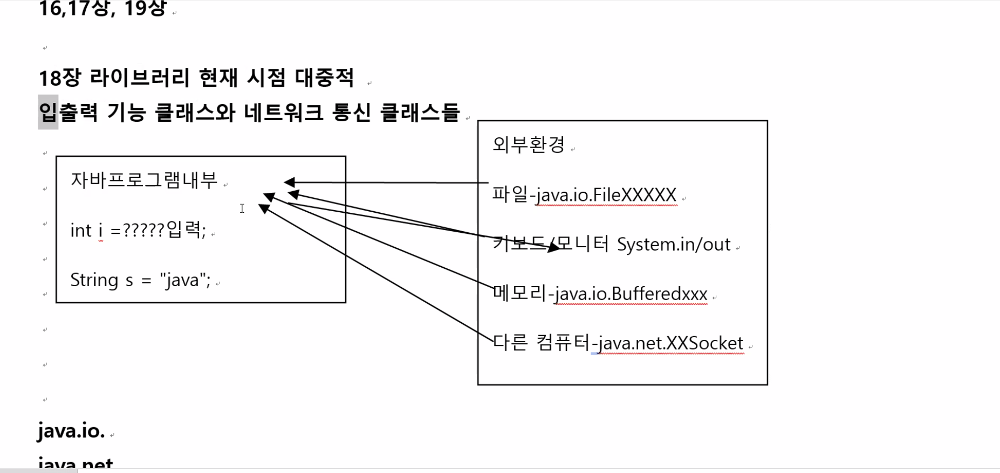

### 1교시 복습

#### 12장 멀티스레드

- main 시작 ~ 호출 메소드 시작 - 종료 - 그 다음 메소드 ... 순차적 종료 -> 싱글스레드

- main 시작 ~ 호출 메소드 시작동시 실행종료 -> 멀티 스레드

- cpu + os -> 멀티스레드 지원해야 자바 멀티스레드 구현 할 수있음

- 방법 

- ```java
  class A extends Thread{
    public void run(){
      동시 다른 프로그램 실행 문장;
    
  }
  main(){
    A a1 = new A();
    A a2 = new A();
    A a3 = new A();
    a1.start(); //상속 시작
    a2.start(); //상속 시작
    a3.start(); //상속 시작
  }
  //4개의 스레드 동시 실행 구조 
  ```

- ```java
  class A extends B implements Runnable{
      public void run(){
      동시 다른 프로그램 실행 문장;
    }
  }
  main(){
    A a1 = new A();
    Thread t1 = new Thread(a1);
    Thread t2 = new Thread(new A());
    Threada t3 = new Thread(new A());
    t1.start(); //상속 시작
    t2.start(); //상속 시작
    t3.start(); //상속 시작
  }
  ```

- `setName()/getName()`

  - `private name`이기때문에 

- `setPriority()/getPriority()`

  - 생성 기본 우선순위 5
  - 대기 시간 길어지면 우선순위 높아짐
  - `setPriority(10)`
  - `Thread.MAX_PRIORITY = 10`
  - `Thread.MIN_PRIORITY` =1
  - `Thread.NORM_PRIORITY` =5

- `sleep()`

  - 1/1000단위 시간 지정하면 일시 중단
    - 출력 속도 조절
  - 아무 스레드나 실행시켜라! 
    - 대기 스레드 우선순위 중 가장 높은 것

- `join()`

  - join 된 스레드에게 cpu 양보하고 현재 스레드 일시 중단
  - 양보된 스레드가 무조건 실행

- 스레드 동기화

  - 멀티스레드 환경에서 2개 이상 스레드들이 1개의 객체를 공유할 수 있는 상황이 있음

    - 객체 메소드나 변수 접근 코드를 동시에 실행ㅇ할 수 있는 가능성이 있다.
    - 변수값 1개 스레드 변경하고 나서 또 다른 스레드가 또 변경

  - 멀티스레드 공유 객체 안정 보장

    - 1개의 스레드가 공유 객체 접근 코드 실행하면 다른 스레드들은 대기
    - 잠금처리 - 열쇠 1개를 순서대로 스레드에게 주는 형태

  - `synchronized`

  - ```java
    public synchronized void method(){
      1;2;3;4;5;
    }
    //한 스레드가 1~5 수행 할 때까지 다른 스레드 접근 불가능  
    ```

    

#### 15장 컬렉션 프레임워크

- `java.util` : 날짜/시간/
  - 컬렉션 : 동적 크기 / 여러가지 서로다른 타입 객체 저장 가능
- List 계열
  - 데이터 = 값
  - 저장 순서 유지 -index 0 ~
  - 같은 데이터 중복 저장 허용

- Map

  - 데이터 = (키, 값)
  - 저장순서 x
  - 키는 중복 불가능, 값은 중복 저장 가능
  - ("id", 100) 

- Set

  - 데이터 = 값
  - 저장순서 x
  - 같은 데이터 중복 저장  -> 무시 

- ```java
  class ArrayList implements List{
    add(Object o); // 여러가지 서로다른 타입 객체 저장 가능
    insertAt(index, Object); //인덱스자리에 끼워넣기
    set(index, Object); //인덱스 자리 값 바꾸기
    remove(index);
    size(); // int
    get(index); //Object
    indexOf(Object o); //int 
    contains(Object o); //boolean
  }
  ```

 

---

- 배열과 컬렉션 프레임워크 - 여러개 데이터 반복

  - (0~ 마지막 데이터, 순차적으로 다음 데이터 이동)

- 일반 반복문

  ```java
  for(int i = 0 ;i<list.size();i++){
    list.get(i);
  }
  ```

  

- 개선된 반복문 

  ```java
  ArrayList list = new ArrayList();
  for(Object o : list){
    	if(o instanceof String) { //예외 처리 
  				System.out.println(((String)o).toUpperCase());
  			}else {
  				System.out.println(o);
  			}
  }
  ```

- ArrayList

  - 여러가지 타입 객체 저장

    - ```java
      ArrayList list = new ArrayList();
      
      list.add(Object o);
      Object <-- list.get(index)
        
      instanceof 타입 체크 구현
      명시적 형변환
      ```

  - 클래스 타입 객체들만 저장

    ```java
    ArrayList<클래스명> list = new ArrayList<클래스명>();
    
    list.add(클래스명 o) ->다른 클래스타입 데이터 저장 시 컴파일 오류
    
    ArrayList<String> list = new ArrayList<String>();
    list.add(String);
    String <-- list.get(0);
    
    ArrayList<Integer> list = new ArrayList<Integer>(); //참조형이 들어가야함 
    list.add(Integer);
    Integer <-- list.get(0);
    
    ArrayList<Employee> list = new ArrayList<Employee>(); //참조형이 들어가야함 
    list.add(Employee);
    Employee <-- list.get(0);
    
      
    ```

  - generic 타입 선언 ArrayList
    - 일반적인( 모든 타입 전용 ArrayList를 만들 수 있다) 
      1. 컴파일러 타입 체크 
      2. 명시적형변환 필요 x
      3. instanceof 타입 체크 필요 x


- Set

  - ```java
    class HashSet implements Set{
      index 유지 x/ 같은 데이터 중복 저장 불가
      size()/ add()/ 조회는 ? -> iterator 혹은 개선된 반복문사용  /제네렉 /논 제네릭/개선된 반복문이 반드시 필요
    }
    ```

  - 100명+? 학생들 시험점수 저장 - ArrayList

  - 로또 번호 - 1 -45 숫자 중복 않는 6개 - HashSet

- Map

  - ```java
    class HashMap implements Map{
      (key, value)
     
    }
    ```

  - (key, value)

  - 데이터 저장 순서 없다

  - 키 중복 x / 값 중복 o

    - 저장 - `put("id",100)`
    - 수정 - `put("id",200)`
    - 삭제 - `remove()`
    - 조회 - `size()`,`get(key)`

---

#### 4교시

- List/ set/ map 특성 /메소드 /generic / for 배웠다!

- Tree Set / Properties(Map)/...

- 여러개 데이터 저장 / 삭제 빈번하다 -linkedlist

- 조회 빈번하다 - ArrayList 효율적

- 15장 특정 타입 객체만 저장 / 삭제 / 조회구조 - 활용

- 13장 generic 개념 + 정의

  - 타입이 일정하지 않다
  - 정해주면 정해준 타입
  - 자바 모든 타입 중 어떤 타입이든 무관
  - 장점
    1. 컴파일러 타입체크 - "견고한 언어"
    2. 명시적형변환 필요없다.
    3. 타입 체크 코드 필요 없다.

- `ArrayList <Employee> list = new ArrayList<Employee>();`

  - List.add(Employee 객체) / Employee e = list.get(0)

- `ArrayList <String> list = new ArrayList<String>();`

  - ​	List.add(String 객체) /String e = list.get(0)

- ```java
  class ArrayList<T> implements List{
    public void add(T t1){}
  }
  ```

- ```java
  class Student<T>{
    T id; //타입이 뭔진 모르고 전달받아야 알게됨
    String name;
    Student(T id, String name){
      this.id= id;
      this.name = name;
    }
  }
  
  main(){
    Student<String> s1 = ...//T자리 String type
      s1.id // String type
      s1.id.toUpperCase();
     Student<Integer> s1 = ...//T자리 Integer type
      s2.id // Integer 타입
      s2.id.toBinaryString(10);
  }
  ```


#### 14장 람다식

- 자바언어 lambda 식 == javascript 언어 -> 화살표 함수

  - ```java
    interface I1{
      void m1();
     
    }
    
    class A implements I1{
      public void m1(){
        오버라이딩...
      }
      +다른 메소드 ,생성자, 변수 추가
    }
    
    main(){
      A a1 = new A();
      a1.m1();
      a1.m2();
    }
    ```

  - ```java
    main(){
      I1 i = new I1(){
        익명 하위 클래스
        다른 메소드 ,생성자, 변수 추가 불가능
          public void m1(){
        오버라이딩...
      }
      };
      	i.m1();
    }
    ```

  - 1개의 메소드만 포함 인터페이스를 구현시에는 무명의 메소드

    ```java
    interface I1{
      void m1(int i);
     
    }
    interface I2{
      void m2(String i);
     
    }
    main(){
      I1 i = (int i)->{오버라이딩} //람다식 
      //modifire 리턴타입 이름(){...}  
      I2 s = (String s) -> {오버라이딩}
    }
    ```

    

- ```java
  //정식 코드
  class A implements Runnable{
    public void run(){
      
    }
  }
  main(){
    A a1 = new A();
    Thread ta = new Thread(a1);
    ta.start();
  }
  ```


- ```java
  Runnable r = () -> {...};
  Thread tr = new Thread(r);
  Thread tr = new Thread(() -> {...});
  tr.start();
  ```

  

---

- 15장  Map / Set / List
- 13장 Generic / 1개 /여러개/ 상속하위클래스
- 14장 람다식 - Functional Interface
  - 매개변수유무 / 리턴값 유무
- 16, 17,19장 패스~
- 18장 라이브러리 현재 시점 대중적
  - `java.io.`
  - `Java.net.`
- 19장 18장 개선 형태 

---


#### 18장

- 입출력 기능 클래스와 네트워크 통신 클래스들
- 

- `java.lang` 30여개

- `java.util` 40여개

- `java.text`

- `java.regexp`

- `java.io.*`50여개 중 필요한 것만 다루겠다

  |                          | 입력                               | 출력                               |
  | ------------------------ | ---------------------------------- | ---------------------------------- |
  | 단위 - 1byte씩(다국어 x) | xxxinputStream                     | xxxoutputStream                    |
  | 단위 - 2byte씩           | xxxReader                          | xxxWriter                          |
  | 입출력기능과 무관        | File - 파일이나 디렉토리 정보 제공 | File - 파일이나 디렉토리 정보 제공 |

  

- `java.net.*`

- |             | 서버                         | 클라이언트                   |
  | ----------- | ---------------------------- | ---------------------------- |
  | TCP         | ServerSocket                 | Socket                       |
  | UDP         | DatagramSoket/ DatagramPaket | DatagramSoket/ DatagramPaket |
  | 통신과 무관 | InetAddress - ip 주소 정보   | InetAddress - ip 주소 정보   |