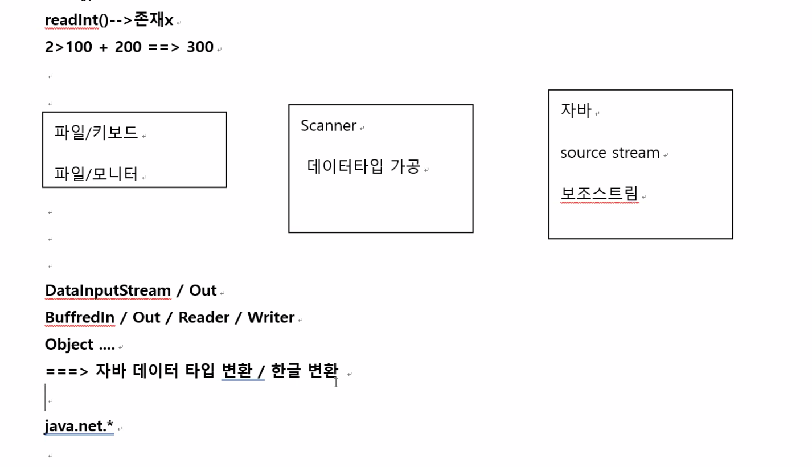

### 20227078

#### 1교시, 2교시

- 입출력

  - 자바프로그램 내부 데이터 받아온다 = 입력

    - 키보드 파일 메모리버퍼

  - 자바프로그램 외부로 데이터를 내보낸다 = 출력

    - 모니터 파일 메모리버퍼

  - 입력스트림 = 데이터(1byte,2byte(char - 단일문자 -unicode - A -65 , a-97)) 연속 흐름

    

- `java.io*`

|                                                              | 입력스트림                                                   | 출력스트림                                                   |
| ------------------------------------------------------------ | ------------------------------------------------------------ | ------------------------------------------------------------ |
| 1byte(바이트스트림)-영문자, a.jpg-이미지, a.mp3 - 음향       | abstract class InputStream{read(); 구현(){}}/ InputStream /xxxxInputStream /FileInputStream extends InputStream{read(){구현}} / read() - 데이터 1바이트씩 입력 / close()- 공통 | OutputStream /xxxxOutputStream/ FileOutputStream/ write(1바이트데이터)/ close()- 공통 |
| 2byte(문자스트림)- 다국어                                    | Reader / xxxReader/ read() - 데이터 2바이트씩 입력/ close()- 공통 finally 블록 처리 | Writer / xxxWriter /write(2바이트 데이터)/write(String - 1개문자 2바이트)/ close()- 공통 |
| File- window- 탐색기, Mac- 파일 관리자 -> 파일이나 디렉토리 취급가능, 자바에서 구현 가능 |                                                              |                                                              |

- 콘솔 입출력

  - 콘솔 입력 - 키보드 입력 - 표준입력

  - 콘솔 출력 - 모니터 출력 - 표준출력

    - `System.out` -> 현재 자바 실행 시스템 모니터 변수

      - `System.out.print()` -> 현재 자바 실행 시스템 모니터로 출력

    - `System.in` -> 현재 자바 실행 시스템 키보드 변수

      - `System.in.read()` -> 현재 자바 실행 시스템 키보드 1byte 입력 기능 메소드 호출
        - 자바 데이터타입사용 불가능, 한글 변환 불가능
          - DataInputStream 이용하면 데이터 타입 변환 사용 가능
          - InputStreamReader 이용하면 한글 변환 가능
          - But, Scanner 가 다해주기때문에..

    - ```java
      class System{
        static InputStream in;
        static PrintStream out; //OuputStream 상속
      }
      ```

    - `java.util.Scanner` -> idk 동일 기능이 여러 클래스 제공 (1018p)

      - `java.util` -> 사용 편리 도와

      ```java
      Scanner s = new Scanner(System.in);
      int result = s.nextInt();
      double d =  s.nenxtDouble();
      boolean b = s.nextBooolean();
      //nextxxx()
      String result1 = s.next(); //한개 단어 - 문자열(문자열 내부 모든 문자들은 2바이트)
      String result2 = s.nextLine(); //1줄 입력
      ```

      

  - 파일은 입력, 출력 다 가능

    

#### 3교시, 4교시 

#### 18.4 파일 입출력 (1018p~1019p)

| FileInputStream | FileOutputStream |
| --------------- | ---------------- |
| FileReader      | FileWriter       |
| File            |                  |

- **File 클래스**

  - 용도

    - os 파일시스템(=파일과 디렉토리) 관리 기능 이용 제공
    - 입출력 기능 메소드 없다.

  - 생성자

    - ```java
      File f = new File("a.txt"); //이클립스 현재 javaproject 루트디렉토리 a.txt 파일 존재한다고 간주
      
      File f = new File("c:/test/a.txt"); //c:/test/a.txt 파일 존재한다고 간주
      
      File f = new File("c:\\test     \\a.txt"); //c:/test/a.txt 파일 존재한다고 간주
      
      File f = new File("c:/java/a.txt"); //c:/test/a.txt 파일 존재한다고 간주
      
      File f = new File("/test/a.txt"); //macos
      
      File f = new File("./a.txt"); //이클립스 현재 디렉토리
      
      File f = new File("../a.txt"); //이클립스 부모 디렉토리 workspace 디렉토리 
      
      File f = new File("."); //이클립스 현재 디렉토리
      
      
      ```

    - `/` : 파일 분리자

      - slash --> linux solaris mac 
        - `\` , `\\`: 파일 분리자
      - 윈도우즈

    - 자바 모든 os 동작한다.

    - 파일이나 디렉토리 구분자 - `/`

    - 파일이나 디렉토리 2가지

      - `C:/....` -> 절대 경로
      - `../a.java` -> 상대 경로

  - 메소드

    - `isFile()`/ `isDirectory()` --> `boolean`
    - `canRead()` ->읽기 가능? --> `boolean`
    - `canWrite()`-> 쓰기 가능?--> `boolean`
    - `length()` -> 파일 총 크기 (byte) -> `int`
    - `getXXXXPath()` -> 파일 모든 경로 -> `String `
    - `lastModefied` ->파일의 최종 수정 시각정보
      - 1/1000 초 단위 
      - `Calendar/ Date/ SimpleDateFormat 
      - String s [] list(); // 디렉토리 내부 세부 내용(파일과 디렉토리 )
    - `exist()` - 파일 존재 여부

  - 파일은 읽기전용 이냐, 읽기 쓰기가능인가로 구분.

- **FileInputStream**

  - 용도 - 파일 내용 입력 , 1바이트

  - 생성자

    - ```java
      FileInputStream fi = new FileInputStream("입력파일명");
      
      FileInputStream fi = new FileInputStream("/*현재디렉토리 생략*/입력파일명");
      
      FileInputStream fi = new FileInputStream("c:/입력파일명");
      
      FileInputStream fi = new FileInputStream("../입력파일명");
      ```

    - 

  - 메소드

    - `read()`

      - `fi.read();`파일 첫 바이트 입력 

      - `int result = fi.read();` : 유니코드 2바이트/ 아스키 코드 1바이트(영문자들 숫자 특수문자몇개 )

      - `result ==> -1` : (end of file - eof)

      - ```java
        while(true){
          int result = fi.read();
          if(result == -1) break;
        }
        fi.close();
        ```

      - ```java
         FileInputStream fi = null;
        try{
         fi = new FileInputStream("입력파일명");
        while(true){
          int result = fi.read();
          if(result == -1) break;
        }
        fi.close();
        
        }catch(IoException e ){
          e.printStack();
        }finally{
          fi.close();
        }
        ```

    - `close()`

- FileOuputStream

  ```java
   FileOutputStream fi = null;
  try{
   fi = new FileOutputStream("입력파일명");
  while(true){
    int result = fi.write(1byte);
    if(result == -1) break;
  }
  fi.close();
  
  }catch(IoException e ){
    e.printStack();
  }finally{
    fi.close();
  }
  ```

- FileReader

```java
 FileReader fi = null;
try{
 fi = new FileReader("입력파일명");
while(true){
  int result = fi.read(); // 2바이트씩 한글가능
  if(result == -1) break;
}
fi.close();

}catch(IoException e ){
  e.printStack();
}finally{
  fi.close();
}
```

- FileWriter

  ```java
   FileWriter fi = null;
  try{
   fi = new FileWriter("출력 파일명",true);
  while(true){
    int result = fi.write("가나다");
    if(result == -1) break;
  }
  fi.close();
  
  }catch(IoException e ){
    e.printStack();
  }finally{
    fi.close();
  }
  ```

- a.txt 파일을 b.txt 파일 복사 

  - a.txt 파일은 입력 - 결과를 b.txt 출력 



```java
Scanner sc = new Scanner(new FileInputStream(""));
  
  Scanner sc = new Scanner(new FileReader(""));
  
  sc.nextInt();

//보조스트림 대신 스캐너 사용
```

